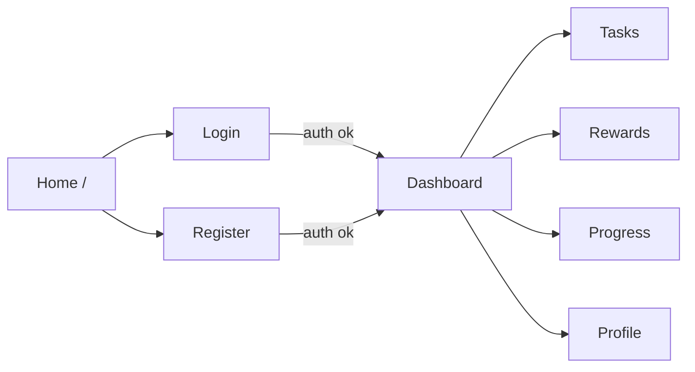

# RotinaXP — Documentação Frontend

**Visão geral**

Este repositório contém o frontend da aplicação RotinaXP: um painel React + TypeScript para gerenciamento de tarefas, pontos e recompensas. O frontend usa Context API para estado, serviços locais que persistem em `localStorage` e está organizado para conectar-se a uma API REST real (há um cliente Axios configurado).

**Como rodar**

- Pré-requisitos: Node.js 18+, npm 9+
- Instalar dependências: `npm install`
- Rodar em modo dev: `npm start` (usa react-scripts)
- Build de produção: `npm run build`
- checagem TypeScript: `npm run typecheck`

**Stack principal**: React, TypeScript, React Router, Context API, Axios, Material-UI (MUI), Framer Motion, Recharts, React Joyride.

**Arquitetura**

- Separação por domínios: `components`, `pages`, `services`, `context`, `hooks`, `routes`, `styles`.
- Providers montados em `src/index.tsx` na ordem: `ThemeProvider` → `AuthProvider` → `AppDataProvider` → `App`.
- Roteamento central em `src/routes/AppRoutes.tsx` com rotas públicas e protegidas (`ProtectedRoute`).

**Estrutura de pastas (resumida)**

```
src/
  components/      # componentes UI reutilizáveis e por domínio (charts, common, layout, navigation, tasks, rewards)
  context/         # providers: AuthContext, AppDataContext, ThemeContext
  hooks/           # hooks de conveniência: useAuth, useAppData, useModal, useThemeMode
  pages/           # telas: Auth (Login/Register), Dashboard, Home, Profile, Progress, Rewards, Tasks
  routes/          # AppRoutes, ProtectedRoute, paths
  services/        # api client, authService (local), tarefaService (usa api), rewardService (local), storage, errorService
  data/            # mockData e seeds
  styles/          # global.css
```

**Fluxo de navegação (alto nível)**

```
Home (/)
  -> Login (/login)
  -> Register (/register)

Protected (require session):
  -> Dashboard (/dashboard)
  -> Tasks (/tasks)
  -> Rewards (/rewards)
  -> Progress (/progress)
  -> Profile (/profile)
```

Mermaid — fluxo de navegação:



Pages / Telas

Para cada tela abaixo estão objetivo, componentes e funcionalidades (baseado nos arquivos reais):

- **HomePage** (`src/pages/HomePage/HomePage.tsx`)
  - Objetivo: página pública de entrada e conversão (links para login/register).
  - Componentes: header, CTA, estatísticas ilustrativas.
  - Funcionalidades: navegação para autenticação.

- **LoginPage** (`src/pages/Auth/LoginPage.tsx`)
  - Objetivo: permitir acesso com conta demo ou cadastrada.
  - Componentes: `AuthLayout`, campos de email/senha, `AlertBanner`.
  - Funcionalidades: chama `useAuth().login`, lida com erros via `errorService`.

- **RegisterPage** (`src/pages/Auth/RegisterPage.tsx`)
  - Objetivo: criar nova conta local (persistida em `localStorage`).
  - Componentes: `AuthLayout`, form de cadastro.
  - Funcionalidades: valida senha localmente, chama `useAuth().register`.

- **DashboardPage** (`src/pages/DashBoard/DashboardPage.tsx`)
  - Objetivo: visão geral de pontos, progresso, tarefas prioritárias.
  - Componentes: `StatCard`, `CompletionChart`, `PointsAreaChart`, `PageTabs`.
  - Funcionalidades: consome `useAppData()` para tasks/rewards/progress.

- **TasksPage** (`src/pages/Tasks/TasksPage.tsx`)
  - Objetivo: CRUD de tarefas (criar, editar, concluir, reabrir).
  - Componentes: `TaskComposer`, `TaskList`, `Modal`.
  - Funcionalidades: usa `useAppData()` que delega para `tarefaService` (API + fallback local storage).

- **RewardsPage** (`src/pages/Rewards/RewardsPage.tsx`)
  - Objetivo: gerenciar recompensas e resgates.
  - Componentes: `RewardComposer`, reward cards, `StatCard`.
  - Funcionalidades: resgate e criação via `AppDataContext` (persistência local por usuário).

- **ProgressPage** (`src/pages/Progress/ProgressPage.tsx`)
  - Objetivo: mostrar histórico de pontos (gráficos).
  - Componentes: `PointsAreaChart`, timeline de tarefas.

- **ProfilePage** (`src/pages/Profile/ProfilePage.tsx`)
  - Objetivo: editar perfil do usuário, meta diária e descrição.
  - Componentes: formulário de edição, `StatCard`.
  - Funcionalidades: `useAuth().updateProfile` atualiza `localStorage` e sessão.

Integração com Backend — mapeamento de chamadas

O projeto tem um cliente Axios em `src/services/api.ts` com `baseURL` definido por `process.env.REACT_APP_API_URL` ou `http://localhost:5000/api`.

Atualmente as chamadas HTTP observadas no código:

- `GET /tarefas` — `tarefaService.getTarefas()` — objetivo: listar tarefas do usuário; resposta esperada: array de tarefas. Em caso de erro, o service usa fallback local (seed/persistência por usuário).
- `POST /tarefas` — `tarefaService.criarTarefa(draft)` — objetivo: criar tarefa no backend; corpo esperado: `{ nome, descricao, categoria, prioridade, dataLimite, pontos, concluida }`. Em falha, o serviço cria e persiste localmente um fallback.
- `PUT /tarefas/:id` — `tarefaService.atualizarTarefa(taskId, draft)` — objetivo: atualizar tarefa; em falha aplica fallback local.
- `PATCH /tarefas/:id/concluir` — `tarefaService.alternarConclusao(taskId)` — objetivo: alternar conclusão; em falha usa fallback local.

Observação: `rewardService` e `authService` não fazem chamadas HTTP — operam exclusivamente em `localStorage` (seed + persistência por usuário). `api.ts` injeta `Authorization: Bearer <token>` se `rotinaxp.auth.session` estiver presente no `localStorage`.

Autenticação — fluxo implementado

- O fluxo é local / demo-first:
  - `authService.getSeedAccounts()` cria/retorna contas seed no `localStorage` (usa `data/mockData.defaultUser` como demo).
  - `loginUser(payload)` valida email/senha contra contas em localStorage e escreve `storageKeys.authSession` com `token` gerado (`demo-token-<userId>`).
  - `registerUser(payload)` cria nova conta em `storageKeys.accounts` e salva sessão.
  - `getStoredSession()` recria sessão a partir do `localStorage` e mantém a sessão atualizada.
  - `clearSession()` remove `rotinaxp.auth.session`.

Mermaid — fluxo de autenticação:

```mermaid
flowchart TD
  A[Login/Register] --> B[authService.loginUser / registerUser]
  B --> C[writeStorage(storageKeys.authSession)]
  C --> D[AuthProvider.setSession]
  D --> E[ProtectedRoute permite acesso]
  E --> F[AppDataProvider.refreshAll -> chama getTarefas/getRewards]
```

Gerenciamento de estado

- `AuthContext` (`src/context/AuthContext.tsx`): guarda `session`, `isAuthenticated`, `isLoading`, `error` e métodos `login`, `register`, `logout`, `updateProfile`, `patchUser`.
- `AppDataContext` (`src/context/AppDataContext.tsx`): expõe `tasks`, `rewards`, `progress`, `isLoading`, `error`, e operações de negócio (`addTask`, `updateTask`, `toggleTask`, `redeemReward`, `addReward`). Faz refresh dos dados ao montar ou mudar sessão.
- `ThemeContext` gerencia `mode` (light/dark) e persiste em `localStorage`.
- Hooks `useAuth`, `useAppData`, `useThemeMode`, `useModal` são thin wrappers sobre `useContext` / `useState`.

Tratamento de erros

- `errorService.getErrorMessage(error, fallback)` normaliza mensagens de erro vindas do Axios ou de `Error` em texto amigável.
- Contexts (Auth/AppData) usam `try/catch` e `getErrorMessage` para popular `error` e apresentar `AlertBanner` nas páginas.

Responsividade e UX

- Estilos estão centralizados em `src/styles/global.css` com classes utilitárias e layouts responsivos.
- Componentes de layout (`Sidebar`, `TopBar`, `AppShell`) suportam colapso e overlay para mobile.
- `ThemeContext` ajusta `document.body` com `data-theme` para alternar tema claro/escuro.
- `GuidedTour` (react-joyride) conduz o onboarding com passos por rota.

Pontos importantes e recomendações rápidas

- Integração real com backend: adaptar `authService` para trocar persistência local por endpoints de autenticação e atualizar `api.ts` para receber o token real.
- `tarefaService` já usa `api` e contém mapeamento de campos (`mapApiTask`) para permitir integrações com formatos de backend diferentes.
- Centralizar toasts/global error UI pode melhorar visibilidade de erros (hoje é `AlertBanner` local em páginas).

---

Arquivo de referência: [src/routes/AppRoutes.tsx](src/routes/AppRoutes.tsx#L1-L100)

Fim da documentação.